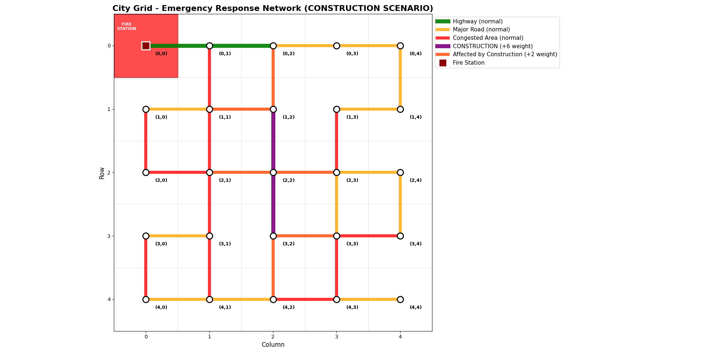

# Firestation Emergency Response Routing

### Overview
This project simulates a fire station's emergency response system, by finding the shortest routes through a city, where different routes have different weights (highway, normal road, congested downtown). 

It uses Dijkstra's Algorithm to take the grid and find the shortest route to each point on the map. 

It then runs through a couple different scenarios that could be pertinent in city planning scenarios.
1. It looks at a what-if analysis of if there was construction on the highway. It takes the roads under construction and adds to their weight. It also adds to the weight of any nearby routes since this simulates people entering the construction zone or trying to take an alternate route during construction. It looks at how this new construction zone would affect the fire department's ability to respond to emergencies in each part of the grid.
2. It looks at a what-if analysis of if a temporary fire station were added during the duration of the construction, and what affect this would have on the fire department's response time. It looks at two alternatives for fire stations that were deemed "approved" by the city: (1,4) and (2,0). It runs through dijkstra's algorithm using the construction grid to get all the response times for these two stations. It then uses a greedy selection algorithm to determine which one has the best response time overall.

### Original Routing
There is a 5x5 grid for the city with the firestation located in (0, 0). There are also lines between grid spots to show the roads.
- Green = Highway, weight of 1
- Orange = Normal road, weight of 2
- Red = Congested road, weight of 4

#### Graph of Original Road Layout

#### Heatmap for Original Layout

### Construction Routing
The same 5x4 grid is used for the city with the firestation in (0,0).
The same lines/line colors and weights are used, except with the following changes made:
- Green = Highway, weight of 1
- Orange = Normal road, weight of 2
- Red = Congested road, weight of 4
- Purple = Under construction, weight +6 from original weight
- Dark Orange = Affected by construciton road, weight +2 from its original weight.

The construction is at two different places along the highway:
- (1,2) -> (2,2)
- (2,2) -> (3,2)

The affected roads are:
- (0,2) -> (1,2)
- (1,1) -> (1,2)
- (2,1) -> (2,2)
- (2,2) -> (2,3)
- (3,2) -> (3,3)
- (3,2) -> (4,2)

#### Construction Road Layout

#### Construction Heatmap

### New Temporary Firestation Addition during Construction
The final scenario that was done was to simulate a city planning decision to alleviate response time increase during construction. City planning approved two possible spots for a new temporary firestation: (2,0) or (1,4) and wants to see if either of these are suitable to help cut down on response times, especially in the southeast corner of the city. 
To simulate this, Dijkstra's algorithm was run on each of these new spots to find the optimal routes and the response times for these.
Once this was run, a comparison analysis was done using a Greedy Selection Algorithm to determine which new location, overall, if added as an additional firestation would cut down on response times the best. 

#### City Layout A (New Firestation placed at (1,4))

#### Heatmap Layout A (New Firestation placed at (1,4))

#### City Layout B (New Firestation placed at (2,0))

#### Heatmap Layout B (New Firestation placed at (2,0))

#### Optimal Heatmap With Two Firestations

#### Analysis
- [Normal Scenario Analysis](fireStationAnalysis.txt)
- [Construction Scenario Analysis](constructionFirestationAnalysis.txt) 
- [Multiple Station Location Analysis](fireStationAnalysis_multiplelocations.txt)